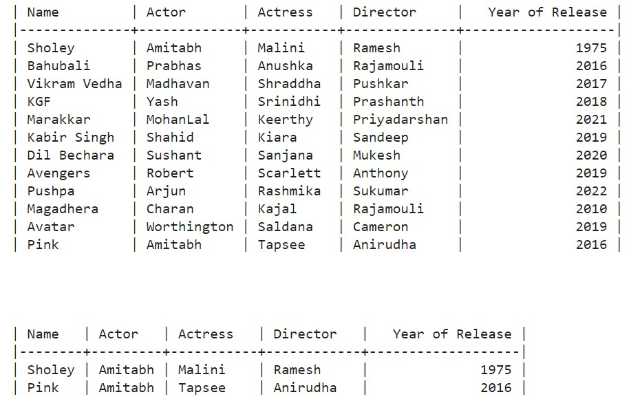

# Problem Statement
All you need to do is create a database, store your interesting movie names with the names of lead actor, actress, year of release and the director name. Once you have stored the details, then use any programming language of your choice to retrieve the details.<b>
To help you even more, we have given the details below. <b>
<h3> Connect to the SQLite database (or any Database you know):</h3> Learn how to download SQLiteJDBC driver and connect to an existing SQLite database using JDBC.<b><h3>Creating a new SQLite database:</h3> Learn how to create a new SQLite database from a Java (any language) program using SQLiteJDBC driver or related driver.<b><h3>Creating a new table (Movies) using JDBC / Other Languages:</h3> before working with data, you need to create a table called Movies. Learn how to create a new table in an SQLite database from a Java (any language) program.<b><h3>Inserting data into Movies table from a Java (any language) program<b><h3>Querying data from Movies table with or without parameters:</h3> 
 after having the movies data in the table, you need to query the movie details (name, actor, actress, director, year of release) using a SELECT statement. You will need to write a program to issue a simple SELECT statement to query all rows from the Movies table, as well as use a query with parameter like actor name to select movies based on the actor's name.
<b><b>
<h2> Output </h2>

